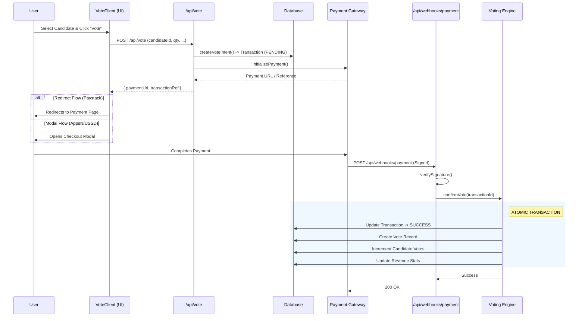

# EaseVote System Architecture: Voting Flow

This document outlines the complete technical flow of a vote in the EaseVote system, from the user interface to the database.

## High-Level Overview

1.  **User Interface**: Voter selects a candidate and initiates payment.
2.  **Logic Layer**: System validates limits, calculates fees, and creates a pending transaction.
3.  **Payment Layer**: User completes payment (Real or Simulated).
4.  **Webhook Layer**: Provider notifies the system of success.
5.  **Confirmation Layer**: System securely records the vote and updates counters.

## Detailed Component Analysis

### 1. Frontend: `VoteClient.tsx`

- **Location**: `app/(main)/events/[eventCode]/vote/[candidateId]/VoteClient.tsx`
- **Responsibility**: Collects voter details (Name, Phone) and Quantity.
- **Action**: Calls `POST /api/vote`.
- **Handling**:
  - If response contains `paymentUrl` (e.g. Paystack), redirects browser.
  - If response is for AppsN, opens `AppsnCheckoutModal` for in-context approval.

### 2. API: `app/api/vote/route.ts`

- **Responsibility**: Entry point for voting.
- **Key Function**: `createVoteIntent` (from `lib/voting/engine.ts`).
  - Validates Event is active.
  - Calculates total price.
  - Creates `Transaction` record with status `PENDING`.
- **Payment Init**: Calls `getPaymentGateway(provider).initializePayment()`.

### 3. Payment Processing

- **Real**: User interacts with Paystack/AppsN interface.
- **Simulated**:
  - `AppsnCheckoutModal` calls `completeSimulatedPayment`.
  - The simulator sends a self-hosted webhook using `x-simulation-key` to bypass security checks.

### 4. Webhook: `app/api/webhooks/payment/route.ts`

- **Security**: Verifies `x-paystack-signature` (Prod) or `x-simulation-key` (Dev).
- **Action**: Calls `confirmVote` if signature is valid.

### 5. Vote Engine: `lib/voting/engine.ts`

- **Function**: `confirmVote(transactionId)`
- **Atomicity**: Uses `db.$transaction` to ensure all-or-nothing execution.
  1.  Checks if Transaction is already SUCCESS (idempotency).
  2.  Updates Transaction to `SUCCESS`.
  3.  Creates `Vote` record.
  4.  Increments `Candidate.votes`.
  5.  Increments `Event.totalVotes` and `Event.totalRevenue`.
